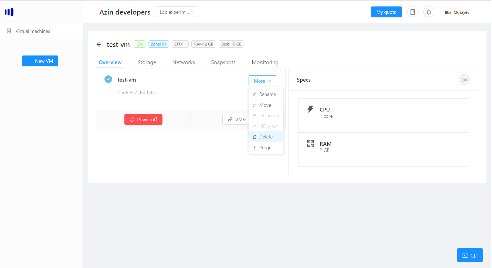
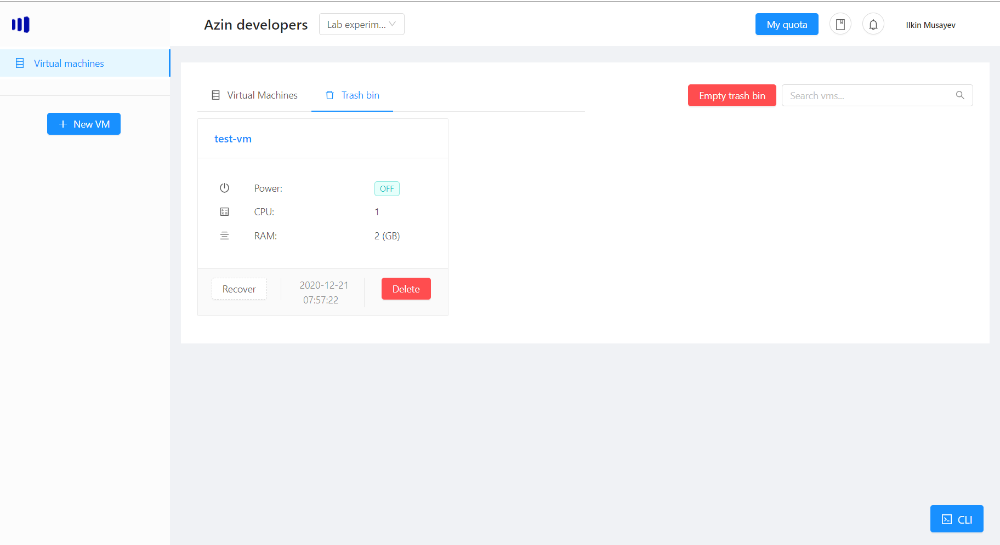
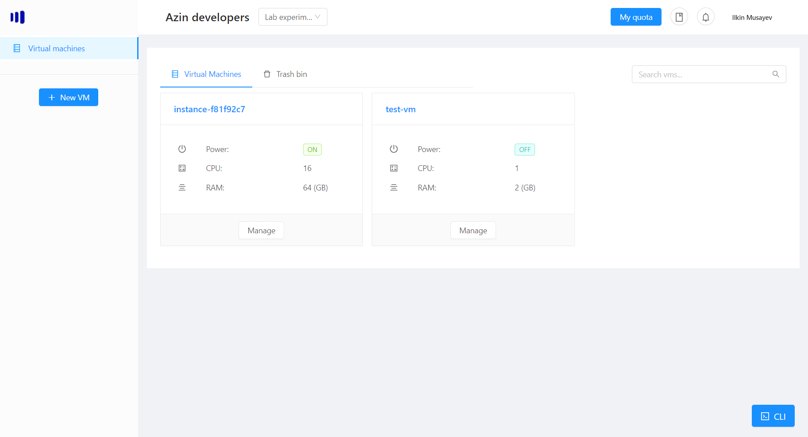
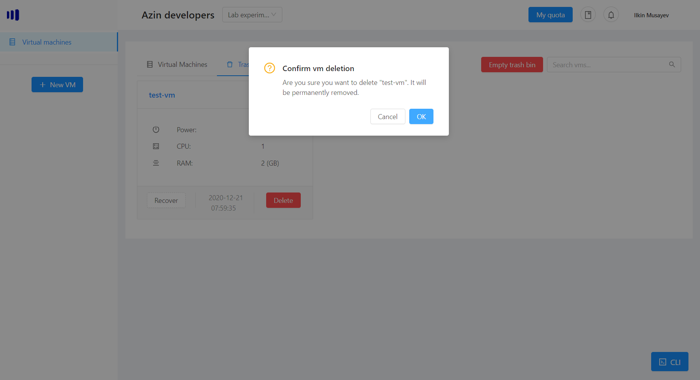
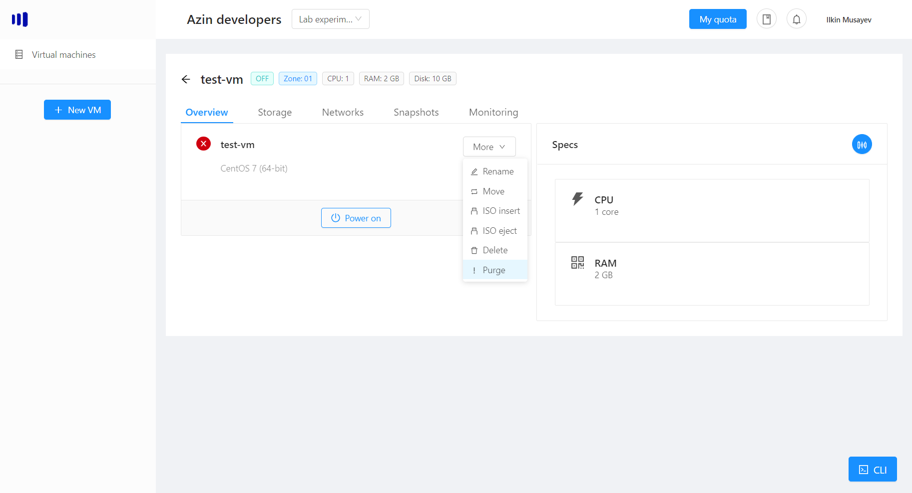

# Working with Trash bin
Trash bin feature allows you to "soft delete" your vms - meaning they are not deleted immediately, but instead are turned off. 

The virtual machines in the bin, stay for up to the week. You can keep up to 5 virtual machines in the bin simultaneously for one project.

## Deleting the vm
To delete the vm, find your vm, then click More -> Delete.

If the vm is turned on, it will be automatically turned off and moved to the trash bin.

## Trash bin
You can now find your vm in the trash bin tab on the home screen:

You have couple of operations you can do with the bin:
- Recover the vm - meaning it will be moved from the trash bin back to the project
- Delete forever - meaning it will be removed completely from the trash bin and cannot be recovered
- Empty trash bin - delete all the vms currently stored in the trash bin for the current project

> Note: the date in the middle corresponds to the time when the vm will be removed from the trash bin forever.

### Recover the VM
Click the Recover button on the vm to return it back to the project:

After you recover the vm, you can find it back in the project:

### Delete forever
Once you click delete forver, the vm will be removed forever along with all its disks:

## Deleting VM without Trash bin
If you want to remove the virtual machine immediately without going to the trash bin, you can use the feature "Purge":
