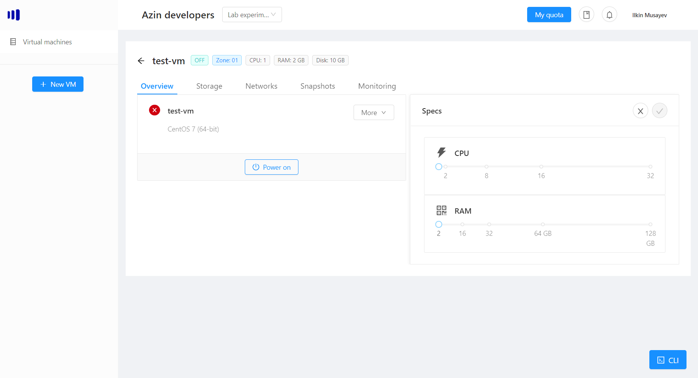

# Increasing/decreasing CPU
You can always increase/decrease the available cpu on your vm, as long as you have enough quota allocated for your company.

## Resize CPU
To resize the cpu, first make sure the vm is turned off. Next choose the vm -> Manage and then click the edit button for the Specs:

After you choose appropriate CPU for your vm, click the tick box besides the Specs:

It will take a few seconds to apply new settings and you can now turn on your vm.

> Note: if you are getting errors related to CPU quota, please contact the Sales team to increase available quota.