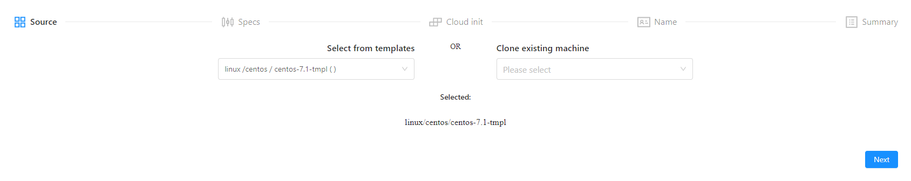
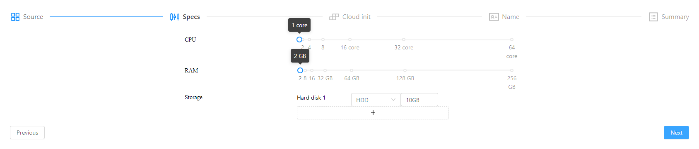
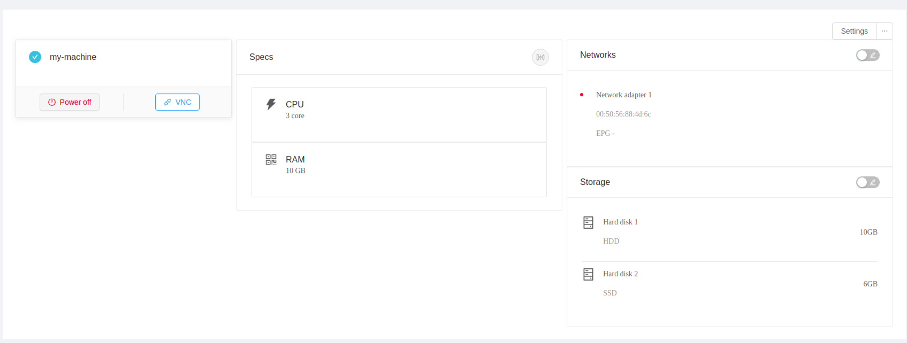
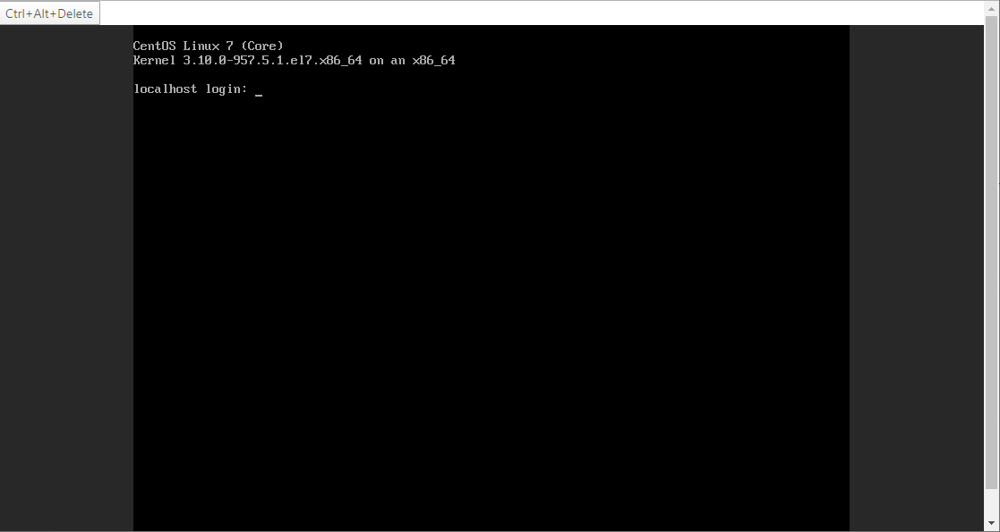

# Getting started with UI

Create your first virtual machine using the UI.

## Access the UI
Login to your account by visiting the link <https://cloud.azintelecom.az>. 
To make your first virtual machine click on ***New Machine*** on the left.

Choose a template from the available ones or clone one of your virtual machines.

!!! Note on cloning
    For now cloning only works within one project. If you have a virtual machine that you want to clone from another project, for now move it to that project, clone and move it back.

## Configuration

You can configure **cpu** and **ram** for your new virtual machine. If you are cloning an existing virtual machine you will also see the size of the disks that will be cloned.

## Cloud init

You can use the industry-standard of cloud init to post-configure your virtual machine. This will be run after all the prerations are finished. You could choose from one of examples, like assigning an ip address or uploading your public ssh key:

## Naming

Choose a name that is unique for your project.

!!! Note on naming
    You can have two virtual machines with the same name if they are part of different projects.

## Final

View a summary of your virtual machine and click OK.

After a few minutes (depending on the size of the virtual machine), you will see the virtual machine appear on the left side. You can now connect to it directly from the browser using VNC button (power on the virtual machine, if you do not see the button):

And you will see the vnc window:

