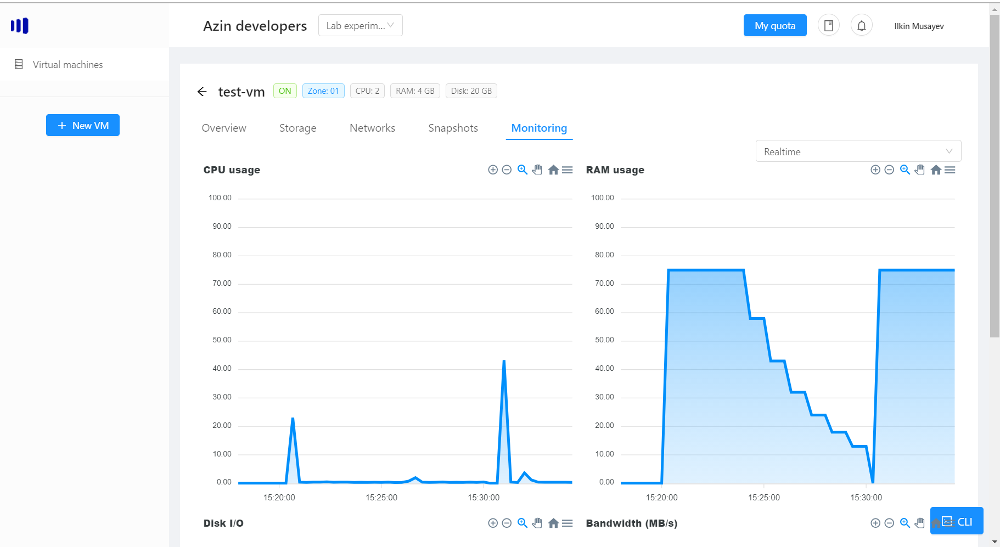
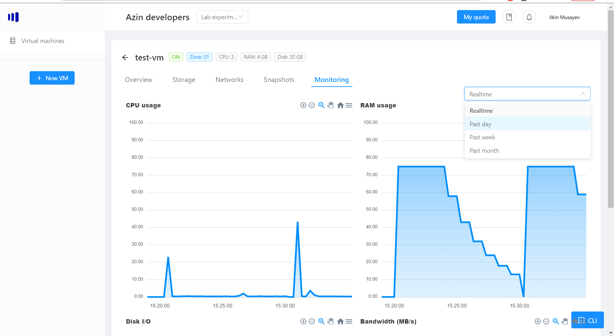
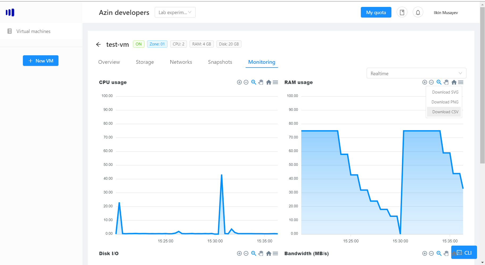

# VM monitoring
Monitoring helps you to get basic information about key metrics of your vm:
1. CPU
2. RAM
3. Disk I/O (how many writes/reads happen)
4. Bandwidth (MB/s) how much data passes in and out of the vm

> Note: monitoring is only available for vms that are turned on.

Click on the monitoring tab to see those metrics:

You can switch between different time frames to get the data for:

> Note: Realtime mode updates data in real-time every 10 seconds.

## Exporting the data
You can export the data in the graphs in different formats: csv, png or svg by clicking on the 3 lines at the top:

Once you choose the format, click on it and the file be downloaded.

