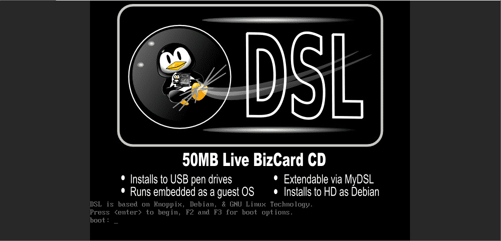

# Mount custom ISO
You can use the feature to install the operating system from custom ISO. To do so, you need to create a virtual machine first. For simplicity, you can choose to create the vm from Centos 7.1.

After you have created the vm, make sure it is turned off and click more:

Then choose an ISO from the list of available ones:

After that start the vm and connect to VNC:

When you have finished instaling the OS, do not forget to do ISO eject (switch off the vm before doing it):

