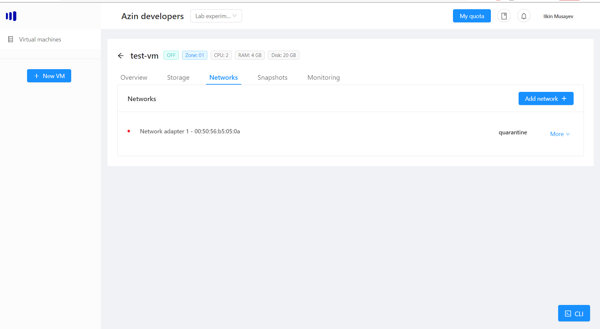
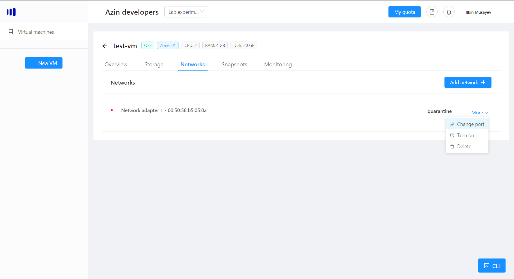
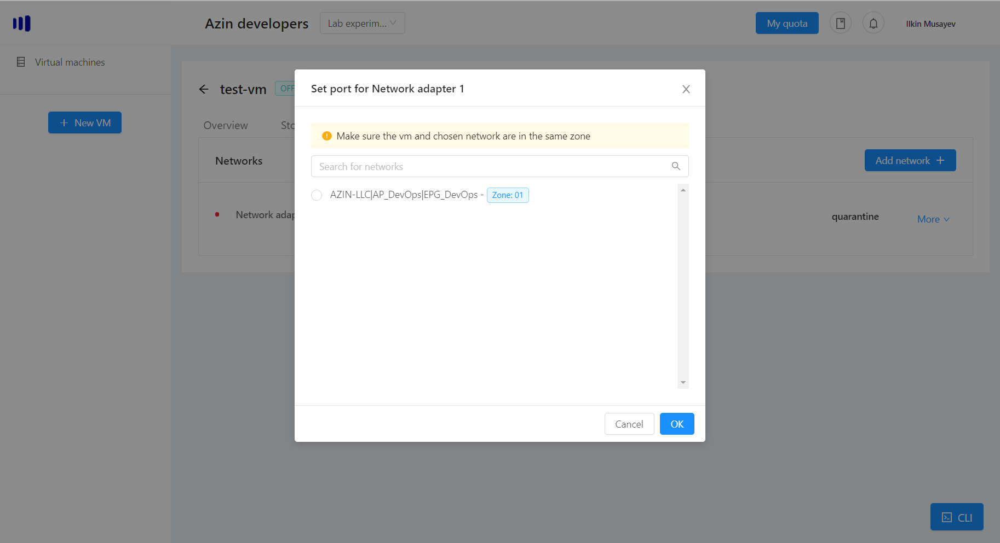
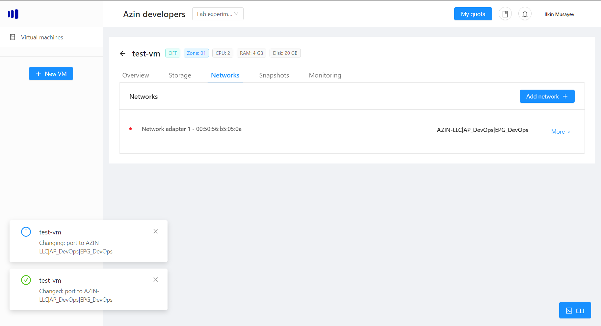
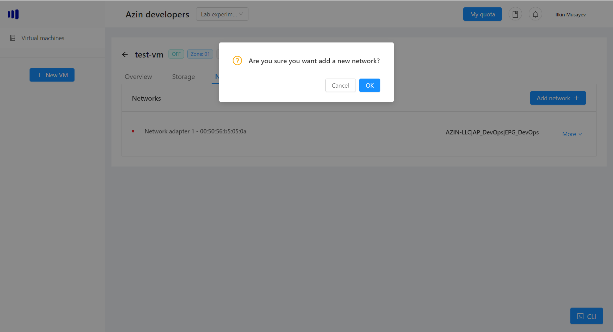
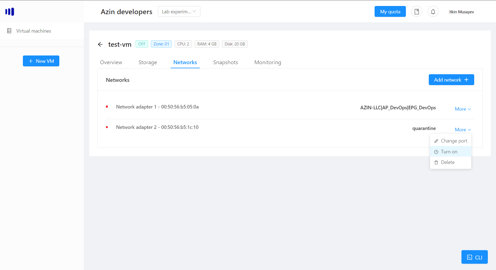
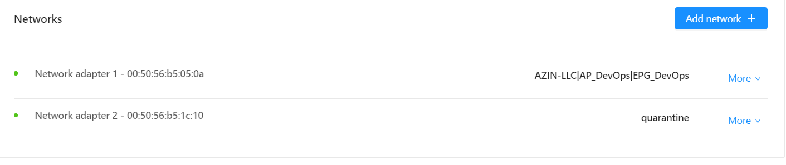
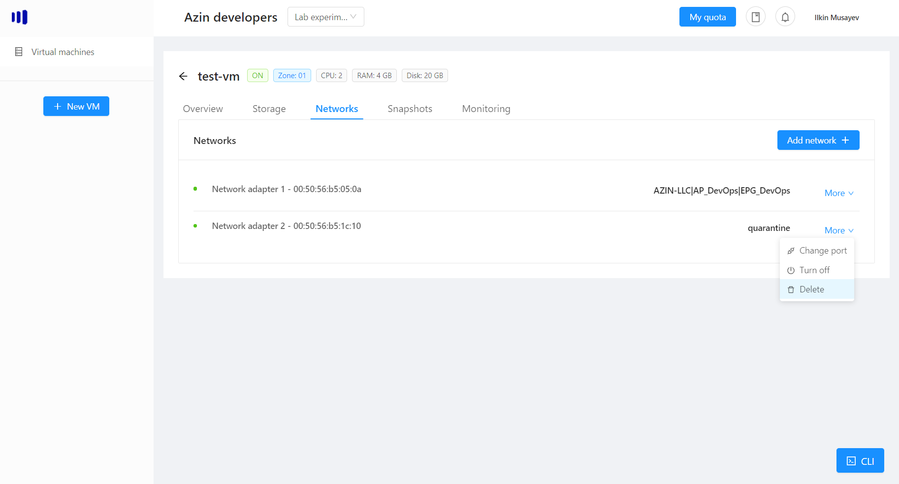

# VM networks
Each vm has a number of network adapters which allow it to connect to different physical networks (epgs) available to your company.

To view all the networks connected to your vm, click on "Networks":

> Note: by default every new adapter gets connected to "quarantine" network, which is like an empty network.

Each network adapter has:
- Name - usually the order in which it was created
- MAC address - uniquely generated once for that adapter when it is created
- Port (EPG) that adapter is connected to
- State - On/off

## Change network's port
If you want to connect your network adapter to a new port, click on "Change port":

You will get a list of ports (epgs) available to your company:

> Note: Each port has a "Zone" field besides it, as well as each vm. This is used, because one port is created in multiple datacenter clusters and you just need to make sure when you choose the port to connect to, it should be in the same zone, as the vm you are connecting it to.

After clicking "OK", your port will be changed:

## Add new adapter
You can always add a new network adapter, by clicking on "Add network +":

Once it is added to your vm, it will be assigned a default port "quarantine", so do not forget to change it to one of your company's port:

## Turning on/off the adapter
Each adapter can either be switched on or off. If it is on and you have configured everything correctly, the traffic will flow to your vm. If you choose to switch off the adapter, the traffic (for that adapter) will stop flowing.

Each adapter has a little dot, besides its name. If it is red, that means it is off, if green it is on:

If you want to switch the state of your adapter click "More" -> and depending on the state "Turn on" of "Turn off":

> Note: If your vm is off, the little dot besides the adapter still will show, that it is off, however when you switch the vm on, the adapter will automatically turn green:

## Delete the network adapter
If you want to delete the network adapter, click More -> Delete:

Once you click "OK", the adapter will be removed from the virtual machine.