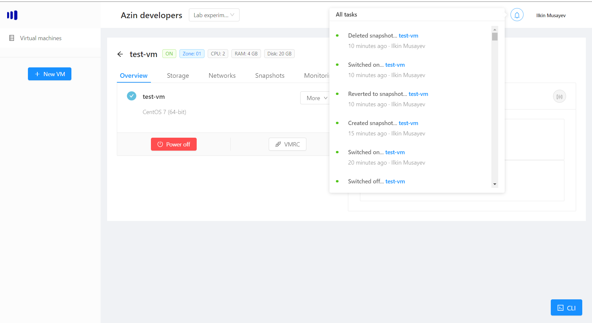
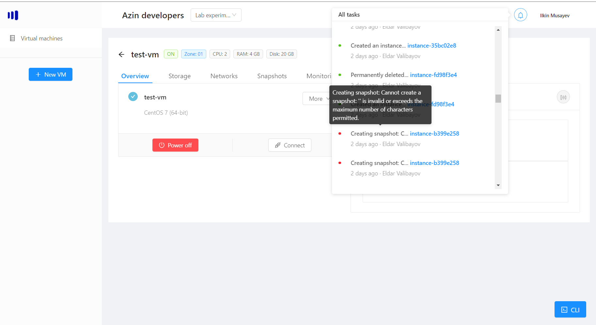

# Notifications
Every action in AzCloud produces a notification and once you login, you are connected to a realtime notification server, meaning if something changes in the current project (by other people in your team as well) you will immediately get latest updates.

Every action, has a person who initiated it and the time.

## All notifications
You can access the latest notifications for the current project, by clicking on the bell icon at the top:

If you hover over the title, you can get more information about the target vm or get more information about errors:

## Realtime notification
As said before, every action in AzCloud produces a notification, which is stored in a log.

For example, if you turn off the vm, you will get two notifications - that it started and completed after a while:
