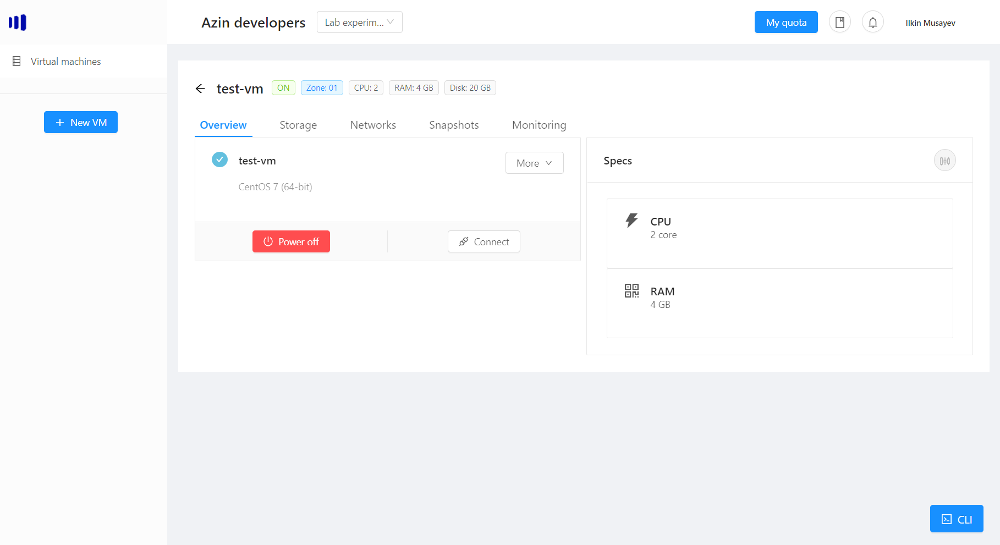

# Switching the VM on/off
Each vm has a power state: On and Off.

When you are listing your vms on the home page, you can see their state. 

## Power off the vm
If you want to switch the vm off, choose the vm that is on and then click "Power off":

> Note: all your network adapters, will turn red, that means that are off.

## Power on the vm
If you want to power on the vm, choose the vm and then click "Power On":

> Note: when the vm is on, you can now connect to VMRC console.