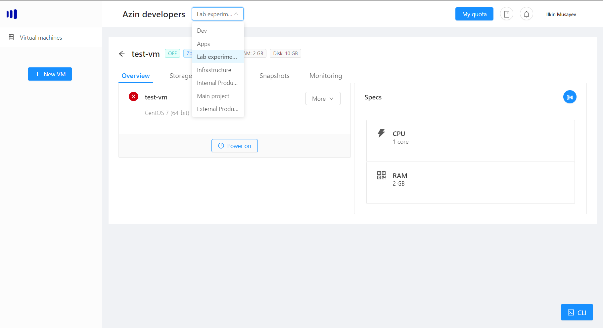
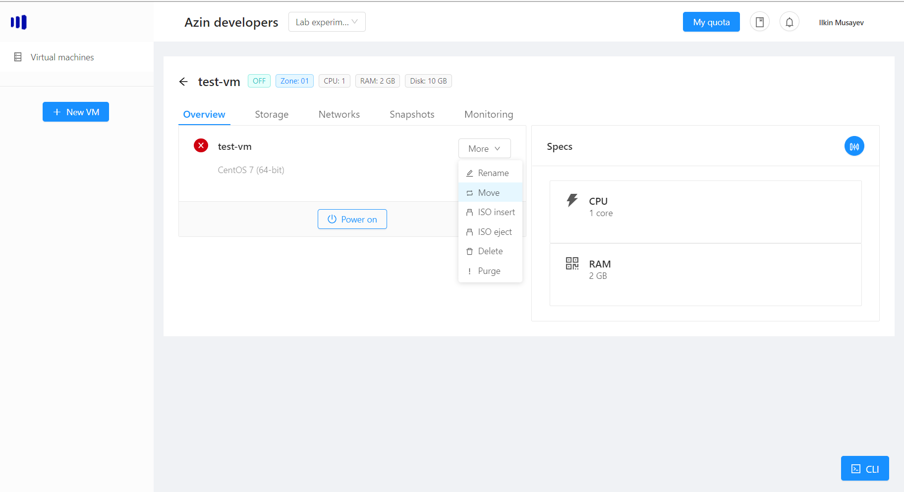

# Projects
Projects allow you to organise your vms by logical separation (networks are not separated by projects).

You can always know what project you are working with by looking at the dropdown besides your company name:

## Switching the project
Click on the project you want to switch to and the list of the vms will be refreshed

## Moving the vm between projects
If you want to move your vm between projects, find your vm click Manage then More -> Move:

After you choose the project to move the vm to, it will be immediately moved to that project:

> Note: make sure there is no vm with the same name in the target project. If there is, the error will happen which will let you know you need to rename either of the vms.

> Note: moving between projects is a logical operation, meaning the vm prefix gets renamed. You can safely move vms between projects any time you want.

## Managing projects
Currently if you want to request more projects, edit or remove a project in your company, you should open a ticket via a Service Desk. This will be fixed in the next release.