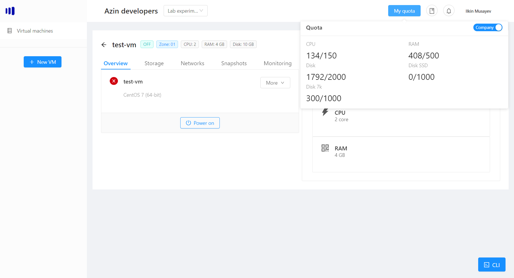

# Company Quota
Your company gets assigned a certain quota, according to your contract with Azintelecom. Your quota consists of:
- CPU
- RAM
- Disk 7k (low-speed storage)
- Disk 10K (medium-speed storage) 
- Disk SSD (fast-speed storage)

The company is divided into a number of projects. However, the total quota for the company is used when resizing cpu, adding vm or adding a new disk. 

You can always view your quota in any project, by hovering over "My quota" button:

The left number corresponds to the current used quota, which is updated in real-time according to the operations you perform.

The right number corresponds to the maximum quota for that metric.

## Project quota
If you want to view current project's quota, instead, click on the "Company" switch:

> Note: If you would like to request more quota for any of the metrics, please contact the Sales team.