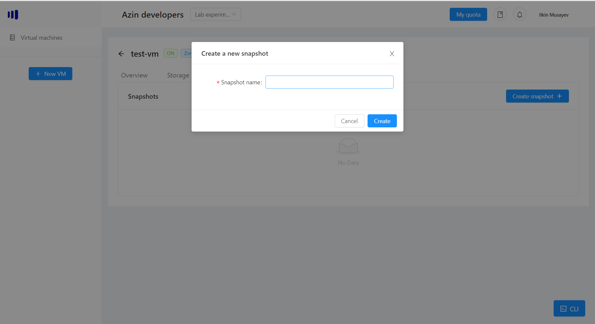
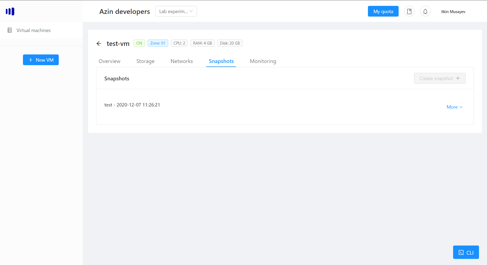
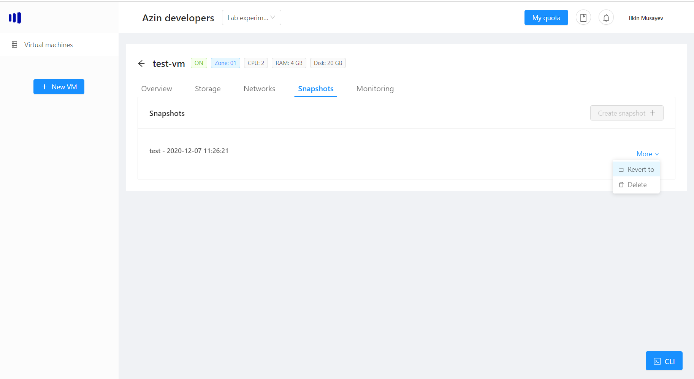
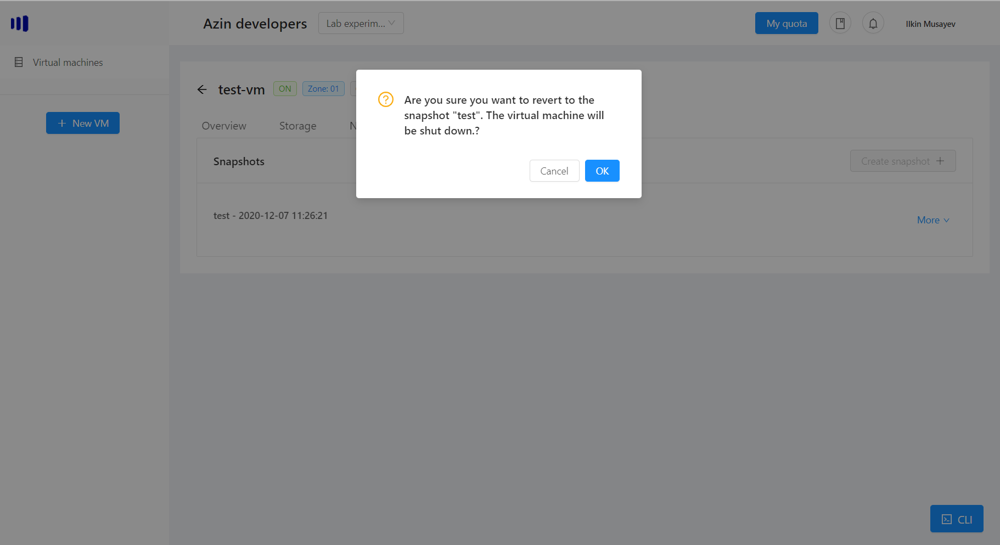
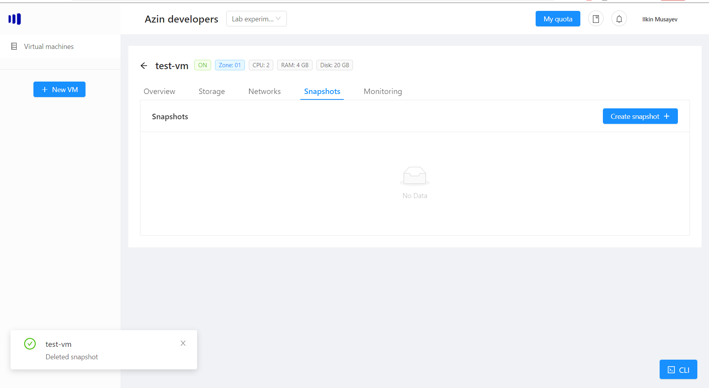

# Snapshots
Snapshots are a useful feature to help you restore the vm to a previous state (all the data on the disk).

It could be used during software updates, database migrations or anything else that saving the state of vm is important.

> Note: Currently, the vm can only store one snapshot at a time.

## Create a snapshot
If you want to create a snapshot of the vm, click "Create snapshot +":

You will be presented with the window to specify the name of the snapshot:

Choose a name and click "OK":

> Note: The snapshot has a time attached to it, when the snapshot was taken. The snapshots are not backups, meaning it will be deleted automatically after a certain amount of time.

## Revert to a snapshot
You can restore to previous state of the vm by choosing the snapshot More -> "Revert to":

> Important: once you revert to the snapshot, the vm will be turned off if it is on

Once you have reverted to the snapshot, you can either delete it manually or let the system delete it after about 3 days.

## Delete a snapshot
If you do not need the snapshot anymore and want to remove, choose the snapshot More -> Delete:

Once you have clicked "OK", the snapshot will be removed:
