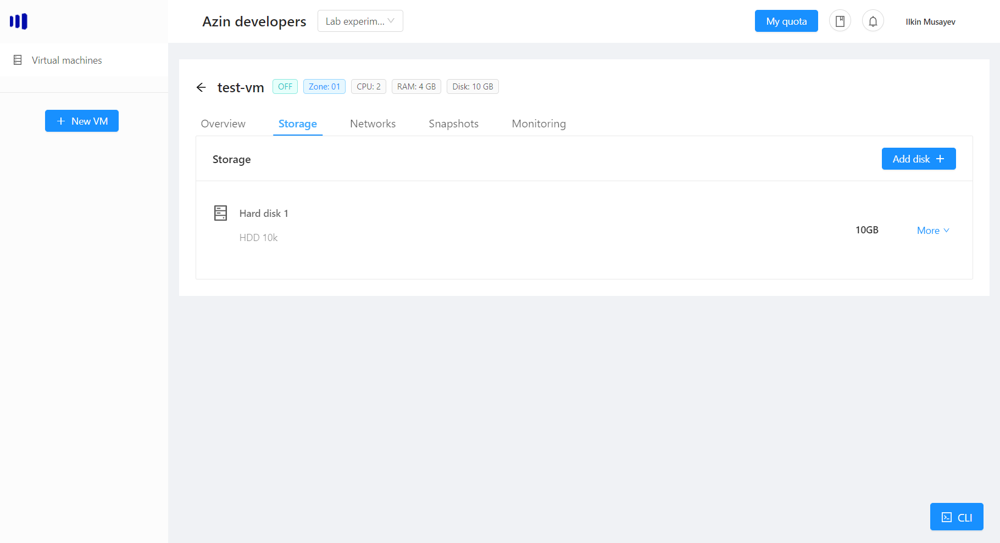
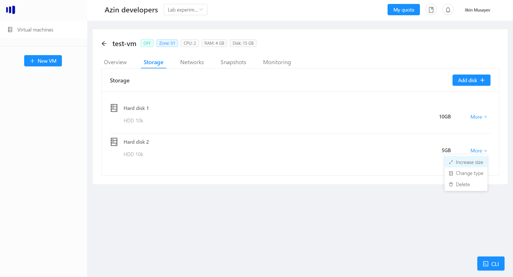
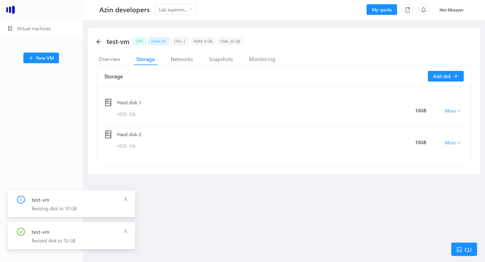
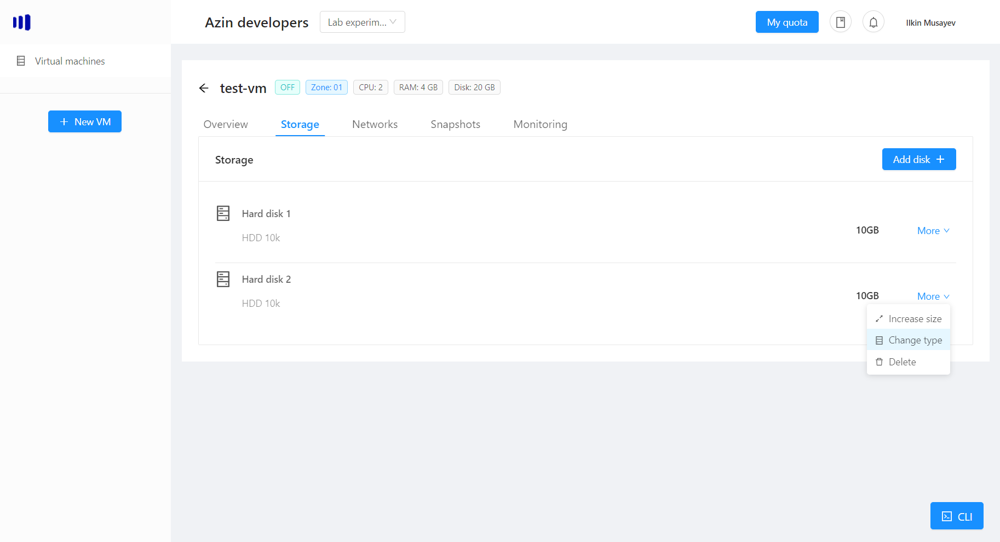

# VM storage
Storage allows to extend your vm's available space. You can always access available storage for your vm in the "Storage" tab:



## Add a disk
If you want to add storage to your vm, click "Add disk +":


You can now choose the Size of the disk (in GB) and the type of storage:
- 7k - slow storage
- 10k - medimum storage
- SSD - fast storage

Depending on the quota available to you, you can choose either storage type that suits your needs and then click Add Disk:

> Note: depending on the disk size, the operation could take from a few seconds to a few minutes.

Now, if you kept your vm turned on during the operation, run the following command to let the system detect the new disk (Linux-only):
```bash
for host in /sys/class/scsi_host/*; do echo "- - -" | sudo tee "$host"/scan >& /dev/null; done
```

## Remove a disk
If you want to remove a disk, choose the disk and then click "More":

> Note: you cannot remove the first disk, as it is being used by the operating system.

Now, if you kept your vm turned on during the operation, run the following command (Linux-only) to let the system detect the removed disk (Suppose you removed /dev/sdb disk):
```bash
$ echo 1 | sudo tee /sys/block/sdb/device/delete >& /dev/null
$ for host in /sys/class/scsi_host/*; do echo "- - -" | sudo tee "$host"/scan >& /dev/null; done
```

## Increase disk's size
You can always increase the disk's size (however, you cannot decrease the disk's size, once it has been increased):

You can then enter the new disk's size:

Then click "Resize disk" to confirm the operation:

Depending on the disk type, it could take from a few seconds to a few minutes.

# Change disk's type
You can always migrate your disk to a different storage type. To do so, choose the disk, click "Change Type":

After that you can choose the new storage type (make sure you have enough quota for the new storage type):


> Note: depending on the disk's size and target type, that could take from a few seconds to a few minutes.