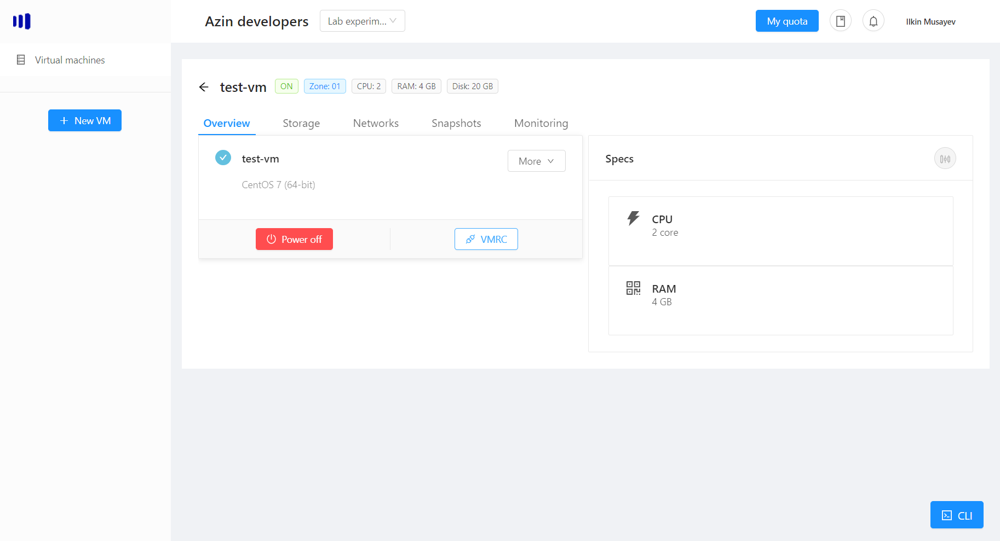

# VMRC console
When you need to connect to your vm using remote console, click on the "VMRC" button (the vm should be on):

The console will be opened in a new browser tab:

> Note: if you cannot connect to your vm, please restart it once.

## Commands
You can switch to a full screen mode, by clicking the full screen button.

### CTRL+ALT+DELETE
Send the CTRL+ALT+DELETE command by clicking on top icon:
